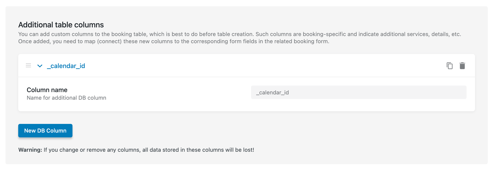

# Delete Booking When External Calendar Entry Deleted
During the synchronization of external calendars for apartments, a new booking entry is created. However, when we modify the external calendar by deleting an entry and re-syncing, it still remains in the booking list on the website, meaning the selected dates cannot be re-booked.

To delete or update the booking status to allow the selected dates to be reused, the following steps need to be taken.

Go to the plugin settings to create an additional custom column in `Bookings > Settings > Tools` and create it with a unique name for saving external calendar information and using it in queries.



After creating the column to store the calendar information, use the `jet-booking/ical/import/node` hook, which is triggered for each booking entry in the calendar during synchronization. This hook allows us to add the calendar identifier to booking entries that are synchronized with the current calendar.

In this case, the calendar identifier will be the link to the calendar in iCal format. The link itself is unique and cannot be duplicated, even within the same service.

The idea is that one apartment can have synchronization with multiple booking services, meaning it will contain several links to external calendars. This step helps to separate the bookings according to the external calendars they belong to within the context of a single apartment (unit).

```php
add_filter( 'jet-booking/ical/import/node', function( $import_node, $node, $calendar_object, $calendar_url ) {

	$import_node['_calendar_id'] = esc_url( $calendar_url ); // `_calendar_id` name of custom created DB column via plugin settings.

	return $import_node;

}, 10, 4 );
```

>The calendar identifier will only be added for new synchronization entries. Bookings that were added after synchronization will have the calendar identifier in the table, while bookings that are already present on the site but were synchronized from this calendar will remain without it.

Next, for the final processing of bookings, we will use the `jet-booking/ical/import/log` hook. Although it is not specifically intended for use in this context, it fits perfectly with the sequence of calls and parameters. The hook is triggered for each calendar in the list for an apartment during synchronization.

Using this hook, we will get all bookings on the site that contain the identifier of the current calendar. These bookings will then be compared to those present in the calendar at the time of synchronization. If there are bookings on the site that are no longer present in the external calendar, as shown in the example below, these bookings will be updated and their status will be changed to `cancelled`.

```php
add_filter( 'jet-booking/ical/import/log', function( $import_log, $post_id, $unit_id, $inserted, $skipped, $calendar_url ) {

	// Get all bookings that related to synced calendar.
	$calendar_bookings = jet_abaf_get_bookings( [
		'meta_query' => [
			[
				'column'   => '_calendar_id', // `_calendar_id` name of custom created DB column via plugin settings.
				'operator' => '=',
				'value'    => $calendar_url
			],
		],
		'return'     => 'arrays',
	] );

	if ( empty( $calendar_bookings ) ) {
		return $import_log;
	}

	foreach ( $calendar_bookings as $booking ) {
		// Compare synced bookings to existing.
		if ( in_array( $booking['ID'], $inserted ) || in_array( $booking['import_id'], $skipped ) ) {
			continue;
		}

		// Change status to cancelled for calendar bookings that not in sync anymore.
		jet_abaf()->db->update_booking( $booking['ID'], [ 'status' => 'cancelled' ] );
	}

	return $import_log;

}, 10, 6 );
``` 

If you need to completely delete the booking from the website, then the line: 

```php
jet_abaf()->db->update_booking( $booking['ID'], [ 'status' => 'cancelled' ] );
```

Can be changed to:

```php
jet_abaf()->db->delete_booking( [ 'booking_id' => $booking['ID'] ] );
```

> All of this will only work starting from plugin version 3.7.1, because that version includes all the necessary updates. Specifically, the `$calendar_url` parameter was added to the `jet-booking/ical/import/log` hook.

